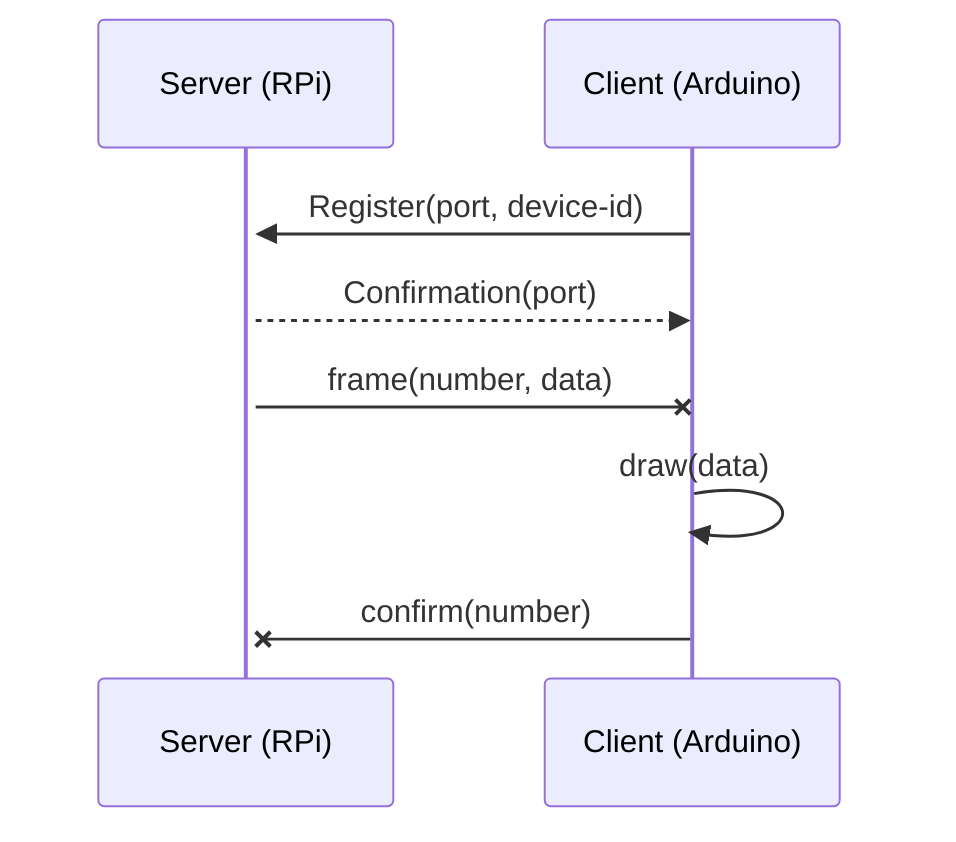

Airpixel Protocol
=================

```mermaid
sequenceDiagram
    participant S as Server (RPi)
    participant C as Client (Arduino)
    C->>+S: Register(port, device-id)
    S-->>C: Confirmation(port)
    S-xC: frame(number, data)
    C->>C: draw(data)
    C-xS: confirm(number)
```
